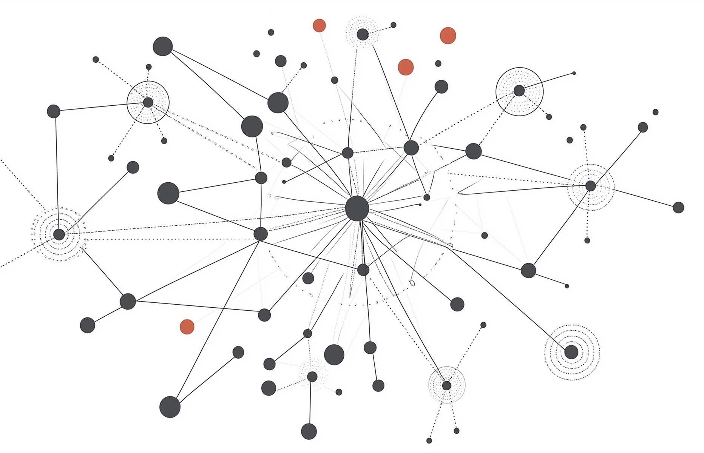

## LKM CallGraph

LKM CallGraph is a static analysis project designed to reconstruct call relationships within a Linux Kernel Module, starting from an entry point. The tool analyzes LLVM IR and builds a directed graph in which each node represents a function and each edge represents a possible call between functions.

The project is inspired by [CallGraph](https://github.com/bernardnongpoh/CallGraph.git), but adds several specific features. It uses a more recent LLVM pass infrastructure and focuses on pointer-based analysis to recover indirect calls and callback relationships. The long-term goal is to provide a practical call graph for Linux Kernel Modules, helping developers understand how functions interact and identify the kernel functionality used by a module without executing it.

<p align="center">
  
</p>

## Features

The project supports direct calls and aims to handle more challenging patterns such as function pointers, callbacks, and pointer-based data flows.

| Feature | Description | Example | Status |
| --- | --- | --- | --- |
| Direct call | A function invokes another function through a direct call site. | `main() { foo(); }` | Complete |
| Indirect call through a function pointer | A function pointer is assigned to a function and called through the pointer. | `void (*fp)() = foo; fp();` | Complete |
| Callback passed through an indirect call | A callback is stored and then invoked through a function pointer parameter or variable. | `set_callback(foo); cb();` | Planned |
| Callback stored in a non-first struct field | A callback is stored in a structure field other than the first field. | `handler.cb = foo; handler.cb();` | Planned |
| Access to a structure through a pointer | A callback or function pointer is reached through pointer dereferencing. | `ptr->cb = foo; ptr->cb();` | Planned |
| Global pointer initialized with a function | A global function pointer is initialized and later invoked. | `void (*g)() = foo; g();` | Planned |
| Function returning a function pointer | A function returns a function pointer that is later used as a callee. | `fn_t get_fn() { return foo; }` | Planned |

## Installing LLVM

LLVM and Clang are required to build and run the project. Follow the official [Getting the source and building LLVM](https://llvm.org/docs/GettingStarted.html#getting-the-source-code-and-building-llvm) guide to install LLVM from source and configure the required environment variables and `PATH` entries.

Verify the installation with:

```bash
llvm --version
clang --version
```

## Installing CMake

On Debian-based systems, install CMake with:

```bash
sudo apt-get install cmake
cmake --version
```

## Notes

Running the LLVM pass on an LKM requires a Linux kernel compiled with LLVM/Clang. For testing, the easiest approach is to boot a virtual machine with a custom kernel built with LLVM/Clang.

## Building

Clone the repository and enter its directory:

```bash
git clone https://github.com/donaldonana/LKM-CallGraph.git
cd LKM-CallGraph
```

Configure and build the project:

```bash
cmake -B build
cmake --build build
```

## Running a Test

Run the example test with:

```bash
./run.sh ./test/hello.c
```
