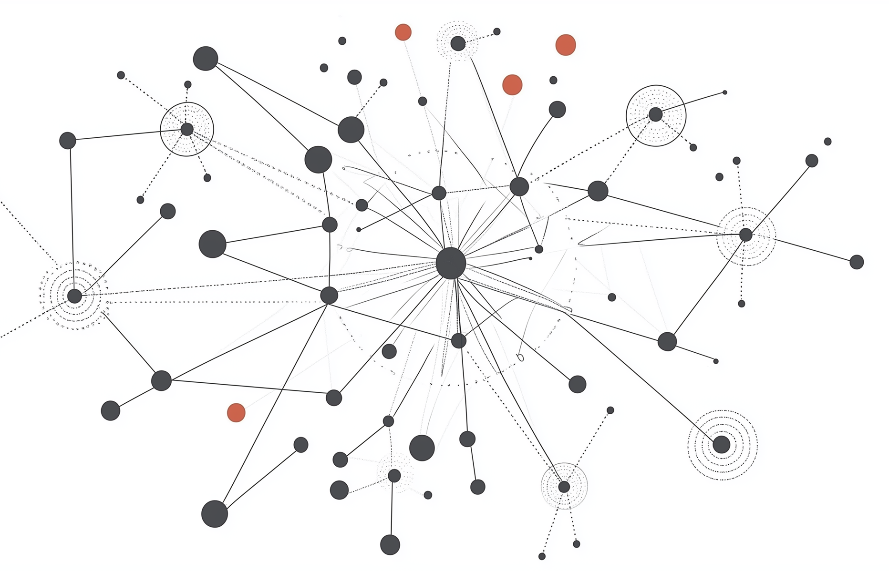
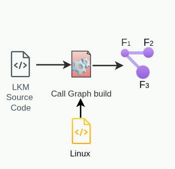

## LKM CallGraph

This project builds a call graph for a Linux Kernel Module, starting from a specified entry point. It analyzes LLVM IR to produce a directed graph in which each node represents a function and each edge represents a possible call.

Inspired by [CallGraph](https://github.com/bernardnongpoh/CallGraph), the tool uses LLVM’s new pass manager and focuses on pointer analysis to identify potential targets of indirect calls, including callbacks.

The goal is to help developers understand function dependencies and identify the kernel functionality a module relies on, without executing it.


<p align="center">
  
</p>

## Features

The project supports direct calls and aims to handle more challenging patterns such as function pointers, callbacks, and pointer-based data flows.

| Feature | Description | Example | Status |
| --- | --- | --- | --- |
| Direct call | A function invokes another function through a direct call site. | `main() { foo(); }` | ✅ |
| Indirect call through a function pointer | A function pointer is assigned to a function and called through the pointer. | `void (*fp)() = foo; fp();` | ✅ |
| Callback passed through an indirect call | A callback is stored and then invoked through a function pointer parameter or variable. | `set_callback(foo); cb();` | Planned |
| Callback stored in a non-first struct field | A callback is stored in a structure field other than the first field. | `handler.cb = foo; handler.cb();` | Planned |
| Access to a structure through a pointer | A callback or function pointer is reached through pointer dereferencing. | `ptr->cb = foo; ptr->cb();` | Planned |
| Global pointer initialized with a function | A global function pointer is initialized and later invoked. | `void (*g)() = foo; g();` | Planned |
| Function returning a function pointer | A function returns a function pointer that is later used as a callee. | `fn_t get_fn() { return foo; }` | Planned |

## How its work ?

The analysis targets a specific kernel version, configuration, and architecture. It runs without loading or executing the LKM.

<p align="center">
  
</p>

### 1.  Generate the kernel IR

The first step is to generate LLVM IR for the Linux kernel. See the Linux kernel IR section in doc.md for detailed instructions.

### 2. Generate the LKM IR
Compile the LKM with LLVM through the kernel build tree, explicitly requesting .ll targets to emit LLVM IR. See the LKM IR section in doc.md for detailed instructions.

### 3. Combine the IR
Use llvm-link to combine the LKM and kernel IR files into a single bitcode file, merge.bc. This allows to have a full call graph by analysising to follow calls from the module into kernel functions whose definitions are included in the combined IR.

### 4. Build the call graph
Run the lkm-callgraph LLVM pass on the combined bitcode using opt. Starting from the specified entry point, the pass identifies direct calls and uses pointer analysis to identify potential targets of indirect calls.

## Prerequisites

The actual test running need the following testbed:

- Linux sources in the root of the project.

- Installing LLVM and Clang **24.0 or newer**, including LLVM development files.

- Installing CMake **4.3 or newer**, as required by the current CMake files.

- An **x86-64** target platform.

- Kernel build dependencies, including Make, a host C compiler, Flex, Bison, and ELF/OpenSSL development headers.

- Graphviz, optionally, to render the graph.

See doc.md for detailed installation instructions. Once the prerequisites are installed, check that the required tools are available in your PATH:

```bash
clang --version
opt   --version
cmake --version

type -a clang opt llvm-link ld.lld
```


## Build the LLVM pass

Clone the project:

```bash
git clone https://github.com/donaldonana/LKM-CallGraph.git
cd LKM-CallGraph
```

From the project root run:

```bash
PROJECT_DIR="$PWD"

cmake -S . -B build
cmake --build build
```

The pass plugin is generated at:

```text
build/src/CallGraph/libCallGraph.so
```

## Run the test

To run the test, you can assume the existing Kernel Linux (V6.8.0) in the artefact folder, or you can build your own by following the leads in the doc.md at Linux kernel IR section.


```bash
llvm-dis artefact/vmlinux.bc -o artefact/vmlinux.ll

./run.sh
```

The script builds the analysis plugin, generate the IR of each LKM in the
`test/`  folder, links each LKM IR with the existing kernel IR, and runs the LLVM with the resulting IR. To run one test following by the name of the LKM.

```bash
./run.sh module-list
```

## Inspect the results

The pass writes these files in a sub directory into artifact, for each LKM test:

   - `graph.text`:   Call relationships in `[caller]:[callee1],[callee2]` format.

   - `graph.dot` :  The call graph in Graphviz DOT format.
   - `pointto.text`:   Pointer-analysis diagnostics, without reachability
   filtering.
   - run.log
   - status.text

Reachable functions with no recorded callees appear as `[function]:`.
